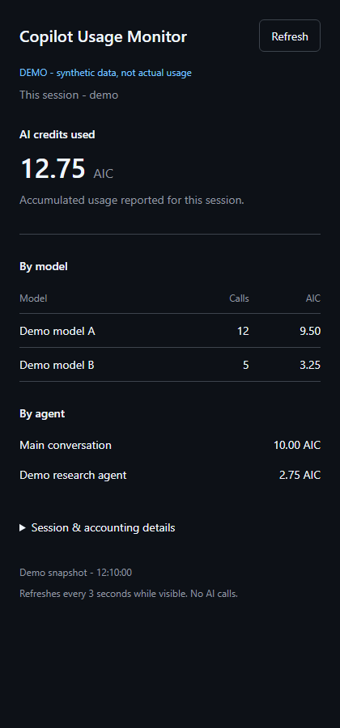

# Copilot Usage Monitor

[](https://github.com/felixArbucias/copilot-usage-monitor/actions/workflows/ci.yml)
[](LICENSE)

**Track AI credits used by each Copilot session, with live model and agent breakdowns.**

A small, read-only canvas for the **GitHub Copilot app**. Each panel reads the current conversation's reported usage, not all sessions at once. It refreshes every three seconds while visible, or when you press **Refresh**. Refreshing does not invoke an AI model.

**Experimental, community-maintained, and not affiliated with GitHub.** Requires a Copilot app/runtime that supports canvas extensions and `session.rpc.usage.getMetrics()`. This is not an account balance, spending limit, or final billing statement.



*Screenshot: synthetic demo data only. No real session IDs, usage, or account information.*

## Install in the Copilot app

1. Open **Customize > Plugins**, then the marketplace settings.
2. Add `felixArbucias/copilot-usage-monitor` as a marketplace.
3. Browse **copilot-usage-monitor-marketplace** and install **copilot-usage-monitor**.
4. Open a new app session, or restart/reload extensions in an existing session.
5. Ask Copilot **"Open Copilot Usage Monitor"** in the conversation you want to measure.

This repository hosts its own marketplace; it is not in an upstream curated catalog. Adding the marketplace does not itself install the plugin. Marketplace data lives at [`.github/plugin/marketplace.json`](.github/plugin/marketplace.json).

**Already using Session AIC or a personal copy?** Follow [the migration steps](#migrate-from-session-aic-v010) before installing. The packaged canvas ID is `copilot-usage-monitor` and its provider ID is `plugin:copilot-usage-monitor:copilot-usage-monitor`.

## Install from the CLI

Use the CLI associated with the app's Copilot configuration. If the app uses a custom `COPILOT_HOME`, the CLI must use the same home for the app to see the installation.

**Recommended: self-hosted marketplace**

```shell
copilot plugin marketplace add felixArbucias/copilot-usage-monitor
copilot plugin marketplace browse copilot-usage-monitor-marketplace
copilot plugin install copilot-usage-monitor@copilot-usage-monitor-marketplace
copilot plugin list
```

**Direct repository installation**

```shell
copilot plugin install felixArbucias/copilot-usage-monitor
```

Choose one installation method, not both. CLI 1.0.86 still supports direct installs but warns they are deprecated in favor of `plugin@marketplace`. The marketplace method is the recommended long-term route.

Installing from a terminal does not turn the terminal into a canvas renderer. Open the panel in the **Copilot app**. Asking the agent to open it is a normal conversation turn; only the panel's polling, Refresh button, and `refresh` canvas action are AI-call-free.

## Update, disable, and uninstall

For the marketplace installation:

```shell
copilot plugin marketplace update copilot-usage-monitor-marketplace
copilot plugin update copilot-usage-monitor@copilot-usage-monitor-marketplace
copilot plugin disable copilot-usage-monitor@copilot-usage-monitor-marketplace
copilot plugin enable copilot-usage-monitor@copilot-usage-monitor-marketplace
copilot plugin uninstall copilot-usage-monitor@copilot-usage-monitor-marketplace
```

Run only the operation you need. For a direct installation, update or uninstall using `copilot-usage-monitor` instead of `copilot-usage-monitor@copilot-usage-monitor-marketplace`. CLI 1.0.86 does not toggle direct-install enablement; uninstall it or switch to the marketplace route instead. Plugin management is also available in the app UI. Restart the affected session or reload extensions after an update or enablement change. Close the panel before uninstalling.

After uninstalling, optionally remove the marketplace:

```shell
copilot plugin marketplace remove copilot-usage-monitor-marketplace
```

## Migrate from Session AIC v0.1.0

Version **0.2.0** renames the repository from `felixArbucias/copilot-session-aic` to `felixArbucias/copilot-usage-monitor` and introduces a new plugin, marketplace, extension folder, and canvas identity. The v0.1.0 tag and original release remain available unchanged. GitHub repository URL redirects do not migrate plugin IDs automatically; this is an explicit uninstall/reinstall, not an in-place plugin update.

Close the old panel first. If you installed through the **old marketplace**, run:

```shell
copilot plugin uninstall session-aic@session-aic-marketplace
copilot plugin marketplace remove session-aic-marketplace
```

If you used the **old direct repository installation**, run this instead:

```shell
copilot plugin uninstall session-aic
```

CLI 1.0.86 has no direct-install enable/disable toggle, so uninstall the old direct copy rather than trying to disable it. If you installed both ways, remove both old entries.

If you also have an optional **personal extension**, disable `user:session-aic` in the app or move that specific `session-aic` folder out of your Copilot `extensions` directory, keeping a backup. Do this before installing the packaged version, even if the personal copy already displays **Copilot Usage Monitor**: a renamed personal copy may deliberately retain its legacy folder and canvas ID to preserve an existing panel. Different IDs still leave confusing duplicate tools; do not run both copies together.

Then install the new marketplace package:

```shell
copilot plugin marketplace add felixArbucias/copilot-usage-monitor
copilot plugin install copilot-usage-monitor@copilot-usage-monitor-marketplace
copilot plugin list
```

Restart the affected session or reload extensions, then ask **"Open Copilot Usage Monitor"**. Old open panels do not automatically switch to the new canvas identity. Usage accounting is unchanged and remains owned by the runtime; no usage database needs to be copied. No command above removes runtime session history.

## What the numbers mean

- **Authoritative total:** the runtime's `totalNanoAiu / 1,000,000,000`. The extension never substitutes premium-request multipliers or estimates credits from token counts.
- **Breakdowns, not extra charges:** model and agent rows describe the same usage. They are not added to the main total. Agent work attributed to this runtime session is included; separate child sessions have their own totals.
- **Runtime-owned persistence:** the extension reads accumulated runtime metrics, not a local event tally. Restored totals can be larger than the currently available model or agent breakdown.
- **Missing is not zero:** missing billing fields display **Unavailable**. A reported numeric zero displays zero. Very small positive amounts display **<0.0001**, rather than rounding to zero.
- **Reporting cadence:** usage changes when the runtime reports it, not token-by-token. The last successful values remain visible after an error, with an explicit stale/error message.

The agent section appears when the runtime reports at least two agent entries. Expand **Session & accounting details** to inspect the session identity, start time, current model, and accounting caveats.

## Privacy and scope

The extension reads only the current session's usage RPC. It does not read transcripts, repository files, credentials, other sessions, or account-wide billing. It does not write a usage database or persist snapshots. The Copilot runtime remains responsible for its own session storage and telemetry.

The renderer and extension communicate over an ephemeral HTTP server bound to **127.0.0.1**, with a random per-panel URL, Host/Origin checks, a restrictive Content Security Policy, and no-store responses. Assets are local; there are no external services, analytics, fonts, or model requests from the panel. Closing the panel stops its server. The random URL is a local capability, not a defense against other processes running as your user; do not share it.

Like other installed extensions, this is executable code running with your user permissions, not a sandbox. Review the source before installing.

## Compatibility and package layout

Version **0.2.0** uses the **legacy Copilot plugin manifest** intentionally, with no Agent Plugins 1.0 `$schema`. In this format, `extensions` is a list of **search roots**, each containing immediate extension subdirectories with an `extension.mjs` entry point:

```text
plugin.json                       # extensions: ["./extensions"]
.github/plugin/marketplace.json   # self-hosted catalog; source: "./"
extensions/
  copilot-usage-monitor/
    extension.mjs
    usage.mjs
    server.mjs
    panel.html
    panel.css
    panel.mjs
    help.txt
```

Pointing `extensions` at `./extensions/copilot-usage-monitor` installs successfully but does **not** discover the extension. The repository's isolated smoke test verifies real discovery, not just JSON parsing.

Agent Plugins 1.0 gives `extensions` a different meaning (namespaced client metadata) and does not define portable canvases. Do not add its `$schema` to this manifest. This plugin targets the Copilot app, not arbitrary Agent Plugins clients or the cloud agent.

The runtime supplies `@github/copilot-sdk/extension`; there is no SDK or runtime dependency to install with npm, and no proprietary SDK files are distributed here. Canvas APIs and usage RPCs are experimental and may change between releases.

**Verified compatibility**

| Surface | Version / coverage |
| --- | --- |
| Original canvas in Copilot app | App runtime **1.0.84-5**: working canvas, live totals, automatic/manual refresh, and narrow dark layout |
| Packaged plugin | CLI/runtime **1.0.86**, with the app's bundled SDK: isolated direct and marketplace install, extension discovery, canvas open/refresh/close, schema rejection, marketplace disable/enable, uninstall, explicit migration from both v0.1.0 install identities |
| Source checks | Node.js **22 and 24**, Windows and Linux in CI |

The app's marketplace settings are the documented installation route. Automated integration checks exercise the same runtime plugin and canvas APIs in a new isolated SDK session, not clicks in the user's live app. Other app versions/platforms are not yet verified. If the usage RPC is absent, the panel reports an update/reload error; if billing fields are absent, it shows **Unavailable**.

Canonical references: [Copilot plugin manifest and marketplace reference](https://docs.github.com/en/copilot/reference/copilot-cli-reference/cli-plugin-reference), [creating a marketplace](https://docs.github.com/en/copilot/how-tos/copilot-cli/customize-copilot/plugins-marketplace), and [plugins across Copilot clients](https://docs.github.com/en/copilot/concepts/agents/about-plugins). The app's bundled SDK `docs/extensions.md` and `canvas.d.ts` describe the experimental extension API.

## Development and verification

Node.js 22 or 24 is sufficient. There are **no npm dependencies** and no install step:

```shell
npm run check
npm test
```

Checks cover module syntax, manifest/package consistency, marketplace paths, accounting, missing versus zero billing, reload persistence, concurrent reads, failure recovery, and loopback HTTP behavior. CI does not download a Copilot SDK or run AI calls.

To exercise a real installation, provide your own compatible Copilot executable and the app's bundled SDK directory:

```shell
node scripts/smoke-plugin.mjs --runtime "<absolute Copilot executable>" --sdk "<absolute copilot-sdk directory>"
node scripts/smoke-plugin.mjs --runtime "<absolute Copilot executable>" --sdk "<absolute copilot-sdk directory>" --marketplace
```

Both use a temporary `COPILOT_HOME` and `COPILOT_CACHE_HOME`, install this checkout, open a new isolated SDK session without sending any prompt, verify the canvas, uninstall, and clean up. They do not modify your live plugin installation or open panels. A local-directory marketplace loads the checkout live; uninstall disables that entry without deleting your source. To test the published repository instead of the checkout, add `--source felixArbucias/copilot-usage-monitor`. Marketplace update/install requires Git and network access for a remote source.

To verify migration in the same temporary home, export the preserved v0.1.0 tag to a separate temporary directory, then add `--legacy-source "<absolute v0.1.0 directory>" --migrate-from direct` or `--migrate-from marketplace` to either smoke command. The script installs v0.1.0, checks its old identity, runs the documented uninstall/removal steps, and verifies only the new packaged provider is discovered. This does not exercise a personal user-scoped copy or migrate an already-open app panel.

For a local synthetic-data preview:

```shell
npm run demo
```

Open the printed loopback URL, and stop the process when done. The screenshot can be regenerated with a Chromium-family browser, using a separate temporary browser profile:

```shell
node scripts/capture-demo.mjs "<absolute Edge or Chromium executable>"
```

Only the screenshot capture inserts the explicit demo banner and fixed display labels; it does not change the shipped panel UI. The demo server never connects to a real session.

## License

[MIT](LICENSE).
